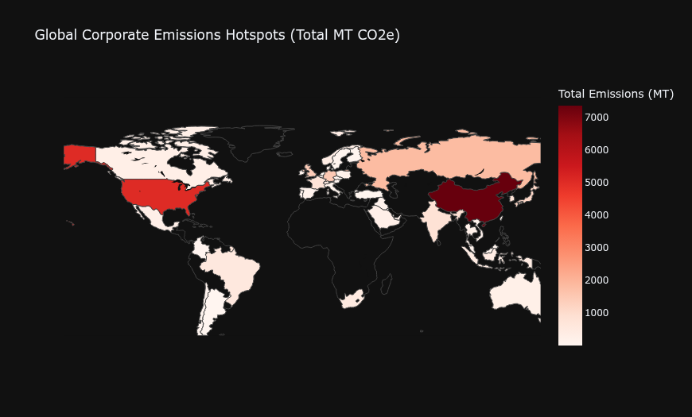
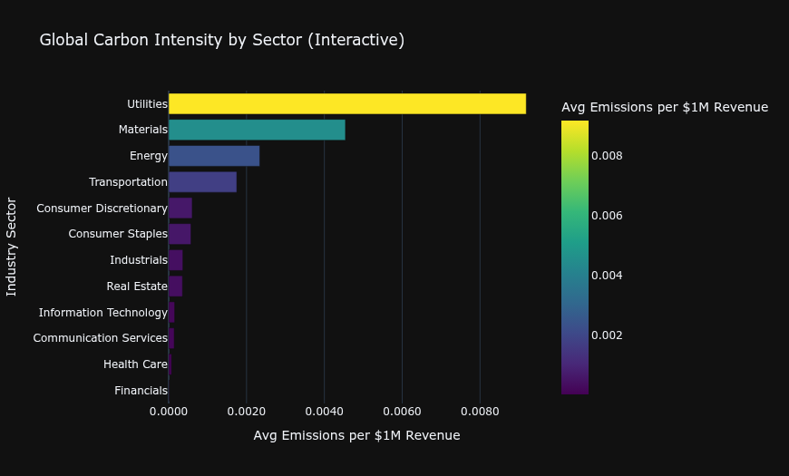
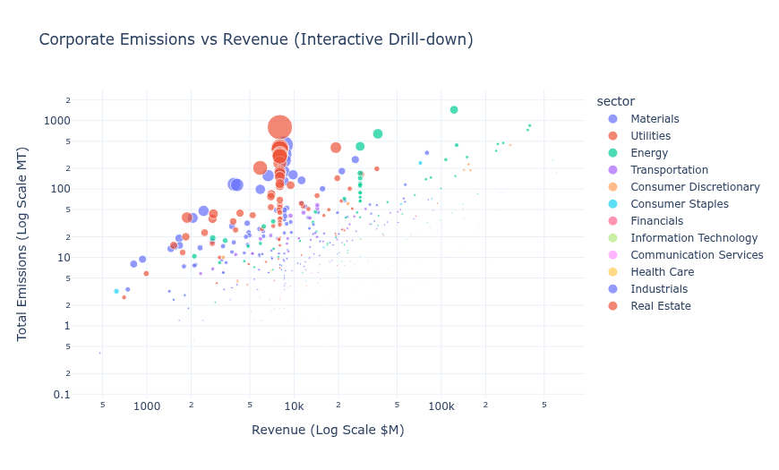

# Global Corporate GHG Emissions: Interactive Engineering Pipeline

## 🎯 Project Overview
This project transforms raw corporate emissions data (2022-2023) into an interactive analytical dashboard. The focus was on building a robust **Data Engineering Pipeline** that handles real-world data "noise" and prepares features for predictive modeling.

## 🛠️ Data Engineering Pipeline (ETL)
The core of this repository is a modular pipeline designed for memory efficiency (optimized for 4GB RAM environments):

1. **Extraction**: Automated discovery of datasets using `os.walk` for environment-agnostic execution.
2. **Transformation**: 
   - Standardized 20+ disparate column names.
   - Handled missing data via **Sector-Median Imputation** (restoring 12.6% of missing revenue records).
   - Engineered `total_ghg_emissions` and `carbon_intensity` metrics.
3. **Normalization**: Scaled features using Min-Max Normalization to prepare the dataset for Machine Learning.
4. **Loading**: Exported to `.parquet` format for high-speed I/O and reduced memory footprint.

## 📊 Analytical Dashboard & Insights

### 🌍 1. Global Emissions Distribution

**Insight:** Emissions hotspots are concentrated in major industrial hubs. The US, and China show the highest cumulative corporate footprints in this dataset.

### 🏭 2. Sector-Wise Carbon Intensity

**Insight:** While the **Energy** sector produces the highest volume, the **Utilities** sector leads in **Carbon Intensity** (emissions per $1M revenue), highlighting a critical area for efficiency improvements.

### 📈 3. Revenue vs. Emissions Drill-down

**Insight:**  Using a logarithmic scale, we identify "Whale" polluters. The size of the bubble represents carbon intensity; larger bubbles indicate companies that are less efficient relative to their financial scale.

## 🚀 How to Run
1. Clone the repo.
2. Ensure `pandas`, `plotly`, and `pyarrow` are installed.
3. Run the main pipeline script to generate `processed_emissions.parquet`.

## 📜 License
This project is licensed under the MIT License.
